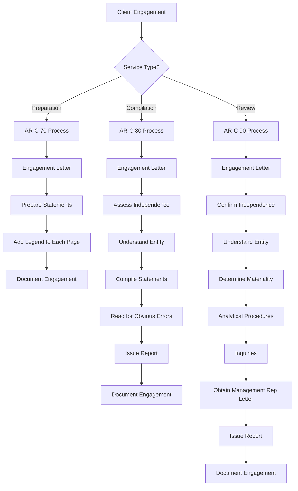

# CJCPAs Ultimate SSARS Library

## The Definitive Compilation and Review Reference - Version 3.0

Welcome to the **Ultimate SSARS Library** - the most comprehensive resource for mastering Statements on Standards for Accounting and Review Services. This library covers every AR-C section with official AICPA language, plain English interpretations, practical implementation guidance, industry-specific modules, case studies, workpaper examples, and a structured database.

---

## What's New in Version 3.0

- **7 AR-C Section Guides** - Now includes AR-C 100 and AR-C 110
- **Industry-Specific Guidance** - Healthcare, Nonprofits, Real Estate, Construction, Restaurants
- **Comprehensive Case Studies** - Real-world scenarios with detailed analysis
- **Workpaper Examples** - Documentation templates and examples
- **Advanced Topics** - Going concern, materiality, complex scenarios
- **Complete Glossary** - 150+ defined terms
- **Enhanced Database** - Expanded JSON with all new content

---

## What's Included

| Category | Contents |
|----------|----------|
| **AR-C Section Guides** | Complete coverage of all 7 sections |
| **Templates** | Engagement letters, reports, representation letters |
| **Checklists** | Analytical procedures, documentation |
| **Industry Guides** | Sector-specific guidance and considerations |
| **Case Studies** | Real-world scenarios with solutions |
| **Workpapers** | Example documentation templates |
| **Advanced Topics** | Complex scenarios and professional guidance |
| **Quick Reference** | At-a-glance cards and comparisons |
| **Resources** | AICPA links, peer review alerts, glossary |
| **Database** | Structured JSON for all standards |

---

## Table of Contents

### AR-C Sections

| Section | Title | Description |
|---------|-------|-------------|
| [AR-C 60](sections/AR-C-60-General-Principles.md) | General Principles | Foundation principles for all SSARS engagements |
| [AR-C 70](sections/AR-C-70-Preparation-Engagements.md) | Preparation of Financial Statements | Preparing financial statements without assurance |
| [AR-C 80](sections/AR-C-80-Compilation-Engagements.md) | Compilation Engagements | Compilations with and without disclosures |
| [AR-C 90](sections/AR-C-90-Review-Engagements.md) | Review of Financial Statements | Limited assurance engagements |
| [AR-C 100](sections/AR-C-100-Special-Considerations.md) | Special Considerations | International and application of framework issues |
| [AR-C 110](sections/AR-C-110-Specified-Elements.md) | Specified Elements | Compilation of specific elements or accounts |
| [AR-C 120](sections/AR-C-120-Pro-Forma.md) | Pro Forma Financial Information | Pro forma compilations |

### Templates

| Resource | Description |
|----------|-------------|
| [Engagement Letters](templates/engagement-letters/) | Preparation, compilation, and review templates |
| [Representation Letters](templates/representation-letters/) | Compilation and review rep letters |
| [Report Templates](templates/reports/) | All standard and modified report variations |

### Checklists

| Resource | Description |
|----------|-------------|
| [Analytical Procedures](checklists/analytical-procedures.md) | Comprehensive analytical procedure checklist |
| [Documentation Checklists](checklists/documentation-checklists.md) | Requirements by engagement type |

### Industry-Specific Guides

| Industry | Guide | Key Topics |
|----------|-------|-----------|
| [Healthcare](industry-guides/healthcare-ssars-guide.md) | Medical practices, clinics | Revenue cycle, third-party payers, A/R |
| [Nonprofits](industry-guides/nonprofit-ssars-guide.md) | Charities, foundations | Net assets, contributions, functional expenses |
| [Real Estate](industry-guides/real-estate-ssars-guide.md) | Property owners, developers | Leases, depreciation, related parties |
| [Construction](industry-guides/construction-ssars-guide.md) | Contractors, builders | Percentage of completion, WIP, retainage |
| [Restaurants](industry-guides/restaurant-ssars-guide.md) | Restaurants, hospitality | Tips, gift cards, inventory, labor |

### Case Studies

| Category | Description |
|----------|-------------|
| [Compilation Cases](case-studies/compilation-case-studies.md) | Complex compilation scenarios |
| [Review Cases](case-studies/review-case-studies.md) | Review engagement challenges |
| [Independence Cases](case-studies/independence-case-studies.md) | Independence threat scenarios |

### Workpaper Examples

| Workpaper | Description |
|-----------|-------------|
| [Review Analytics](workpapers/review-analytical-procedures-wp.md) | Complete analytical procedures documentation |
| [Workpaper Templates](workpapers/) | Documentation examples and templates |

### Advanced Topics

| Topic | Description |
|-------|-------------|
| [Going Concern](advanced-topics/going-concern-guidance.md) | Evaluation and disclosure guidance |
| [Materiality](advanced-topics/materiality-guidance.md) | Determination and application |
| [Advanced Topics Overview](advanced-topics/) | Complex scenario guidance |

### Quick Reference

| Resource | Description |
|----------|-------------|
| [Service Comparison Card](quick-reference/service-comparison-card.md) | Side-by-side comparison |
| [Engagement Workflow Card](quick-reference/engagement-workflow-card.md) | Step-by-step workflows |

### Resources

| Resource | Description |
|----------|-------------|
| [AICPA Resources](resources/aicpa-resources.md) | Official AICPA links and materials |
| [Peer Review Alerts](resources/peer-review-alerts.md) | Common deficiencies and prevention |
| [Glossary](resources/glossary.md) | 150+ defined terms |

### Data

| Resource | Description |
|----------|-------------|
| [SSARS Database](data/ssars-database.json) | Structured JSON database |

---

## Quick Reference Guide

### Service Level Comparison

| Feature | Preparation | Compilation | Review |
|---------|:-----------:|:-----------:|:------:|
| **AR-C Section** | 70 | 80 | 90 |
| **Independence Required** | No | No* | **Yes** |
| **Report Issued** | No (legend only) | Yes | Yes |
| **Level of Assurance** | None | None | Limited |
| **Analytical Procedures** | Not required | Not required | **Required** |
| **Inquiries** | Not required | Not required | **Required** |
| **Management Rep Letter** | Not required | Recommended | **Required** |
| **Engagement Letter** | Required | Required | Required |
| **Can Omit Disclosures** | Yes | Yes | No |

*Lack of independence must be disclosed in compilation report

### When to Use Each Service

```
PREPARATION (AR-C 70)
├── Internal use only
├── No third-party reliance
├── Most cost-effective
└── No CPA report issued

COMPILATION (AR-C 80)
├── Third parties may use
├── No assurance needed
├── Report issued
└── Can omit disclosures

REVIEW (AR-C 90)
├── Third parties require assurance
├── Bank/creditor requirement
├── Limited assurance provided
└── Full disclosures required
```

---

## Independence Requirements

```
┌─────────────────────────────────────────────────────────────┐
│                    INDEPENDENCE SUMMARY                      │
├─────────────────────────────────────────────────────────────┤
│  PREPARATION (AR-C 70)                                       │
│  ✓ Independence NOT required                                 │
│  ✓ No disclosure needed                                      │
├─────────────────────────────────────────────────────────────┤
│  COMPILATION (AR-C 80)                                       │
│  ✓ Independence NOT required                                 │
│  ⚠ If not independent, MUST disclose in report              │
│  ✗ Cannot disclose reason for lack of independence          │
├─────────────────────────────────────────────────────────────┤
│  REVIEW (AR-C 90)                                            │
│  ✗ Independence IS REQUIRED                                  │
│  ✗ Cannot issue review if not independent                   │
│  ✓ May step down to compilation if independence impaired    │
└─────────────────────────────────────────────────────────────┘
```

---

## Engagement Workflow



---

## How to Use This Library

### For New Engagements

1. **Start with [General Principles (AR-C 60)](sections/AR-C-60-General-Principles.md)** - Foundation requirements
2. **Determine service level** - Use the [Service Comparison Card](quick-reference/service-comparison-card.md)
3. **Review independence** - Check [Independence Case Studies](case-studies/independence-case-studies.md)
4. **Select your AR-C section** - Follow the relevant section guide
5. **Get industry-specific guidance** - Use [Industry Guides](industry-guides/)
6. **Use templates** - Customize [engagement letters](templates/engagement-letters/) and [reports](templates/reports/)
7. **Follow checklists** - Ensure complete [documentation](checklists/documentation-checklists.md)

### For Complex Situations

1. **Review [Case Studies](case-studies/)** - Find similar scenarios
2. **Check [Advanced Topics](advanced-topics/)** - Going concern, materiality, etc.
3. **Consult the [Glossary](resources/glossary.md)** - Clarify terminology
4. **Review [Peer Review Alerts](resources/peer-review-alerts.md)** - Avoid common deficiencies

### For Training

1. **Study the AR-C sections** - Understand requirements
2. **Work through case studies** - Apply knowledge
3. **Review workpaper examples** - Learn documentation standards
4. **Use checklists** - Build consistent processes

---

## Documentation Requirements

### Assembly Deadline
Complete documentation within **60 days** of report date.

### Retention Period
Retain documentation for minimum **5 years** (check state requirements).

### Key Documentation by Service

| Documentation | Preparation | Compilation | Review |
|--------------|:-----------:|:-----------:|:------:|
| Engagement Letter | Required | Required | Required |
| Independence Assessment | No | Yes | Yes |
| Entity Understanding | Basic | Yes | Yes |
| Materiality Determination | No | No | Yes |
| Analytical Procedures | No | No | Required |
| Inquiry Documentation | No | No | Required |
| Management Rep Letter | No | Recommended | Required |
| Report/Legend | Legend | Report | Report |

---

## Common Peer Review Deficiencies

### Top Issues to Avoid

| Rank | Deficiency | Prevention |
|------|------------|------------|
| 1 | Missing/incomplete engagement letter | Use templates, get signed before work |
| 2 | Independence not documented | Evaluate and document for every engagement |
| 3 | No independence disclosure (compilation) | Add disclosure if not independent |
| 4 | Insufficient analytical procedures (review) | Document expectations and follow-up |
| 5 | Missing management rep letter (review) | Required - no exceptions |
| 6 | Incorrect report language | Use current templates |
| 7 | Missing legend on preparations | Legend on EACH page |
| 8 | Inadequate documentation | Document procedures AND conclusions |

See [Peer Review Alerts](resources/peer-review-alerts.md) for detailed guidance.

---

## Repository Structure

```
CJCPAs-Ultimate-SSARS-Library/
├── README.md                              # This file
├── data/
│   └── ssars-database.json                # Structured SSARS data
├── sections/
│   ├── AR-C-60-General-Principles.md
│   ├── AR-C-70-Preparation-Engagements.md
│   ├── AR-C-80-Compilation-Engagements.md
│   ├── AR-C-90-Review-Engagements.md
│   ├── AR-C-100-Special-Considerations.md  # NEW
│   ├── AR-C-110-Specified-Elements.md      # NEW
│   └── AR-C-120-Pro-Forma.md
├── templates/
│   ├── engagement-letters/
│   ├── representation-letters/
│   └── reports/
├── checklists/
│   ├── analytical-procedures.md
│   └── documentation-checklists.md
├── industry-guides/                        # NEW
│   ├── README.md
│   ├── healthcare-ssars-guide.md
│   ├── nonprofit-ssars-guide.md
│   ├── real-estate-ssars-guide.md
│   ├── construction-ssars-guide.md
│   └── restaurant-ssars-guide.md
├── case-studies/                           # NEW
│   ├── README.md
│   ├── compilation-case-studies.md
│   ├── review-case-studies.md
│   └── independence-case-studies.md
├── workpapers/                             # NEW
│   ├── README.md
│   └── review-analytical-procedures-wp.md
├── advanced-topics/                        # NEW
│   ├── README.md
│   ├── going-concern-guidance.md
│   └── materiality-guidance.md
├── quick-reference/
│   ├── service-comparison-card.md
│   └── engagement-workflow-card.md
└── resources/
    ├── aicpa-resources.md
    ├── peer-review-alerts.md
    └── glossary.md                         # NEW
```

---

## Version History

| Version | Date | Changes |
|---------|------|---------|
| 3.0 | 2024 | Added AR-C 100/110, industry guides, case studies, workpapers, advanced topics, glossary |
| 2.0 | 2024 | Complete library with all core AR-C sections, templates, checklists |
| 1.0 | 2024 | Initial comprehensive SSARS library release |

---

## Important Disclaimers

This library is provided for educational and reference purposes. Users should:

- Always consult current AICPA Professional Standards
- Consider state board requirements and ethics rules
- Apply professional judgment to specific situations
- Stay current with ARSC pronouncements and interpretations

**Standards Coverage**: Content reflects SSARS No. 21-28 and related amendments. Always verify current effective dates.

---

## Additional Resources

- [AICPA SSARS Homepage](https://www.aicpa.org/resources/article/statements-on-standards-for-accounting-and-review-services-ssars)
- [AICPA Professional Standards](https://www.aicpa.org/resources/download/aicpa-professional-standards)
- [Accounting & Review Services Committee](https://www.aicpa.org/resources/article/accounting-and-review-services-committee)
- [Peer Review Program](https://www.aicpa.org/resources/article/aicpa-peer-review-program)
- [Code of Professional Conduct](https://www.aicpa.org/resources/download/aicpa-code-of-professional-conduct)

---

## Contributing

This library is maintained by CJCPAs. Suggestions and improvements are welcome.

---

*Maintained by CJCPAs - Committed to Excellence in Professional Standards*

**The Ultimate SSARS Library - Because Good Enough Isn't Good Enough**
