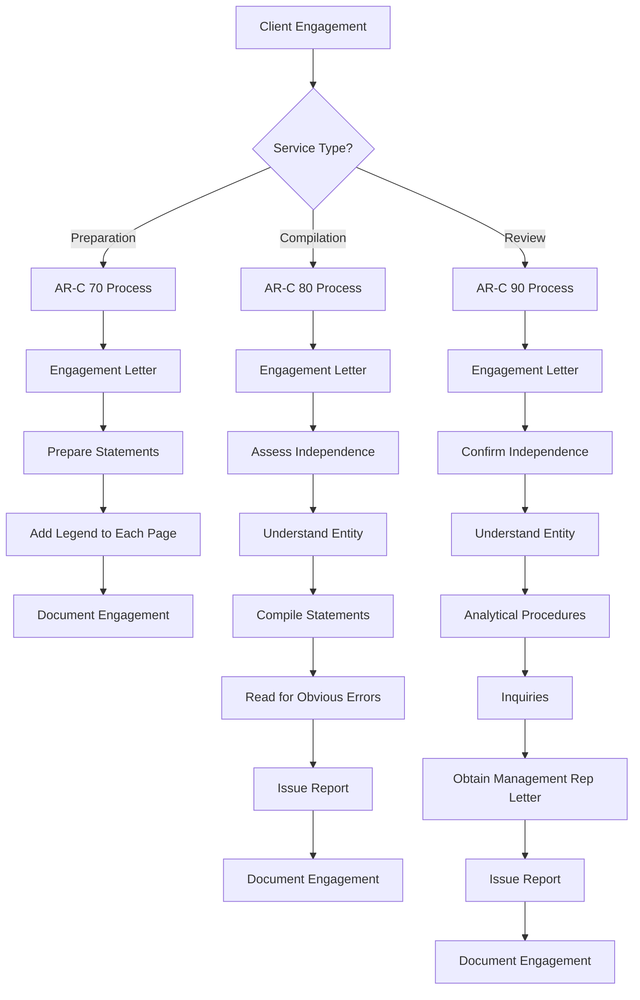

# CJCPAs Ultimate SSARS Library

## The Complete Compilation and Review Reference

Welcome to the **Ultimate SSARS Library** – your comprehensive resource for mastering Statements on Standards for Accounting and Review Services. This library covers every AR-C section with official AICPA language, plain English interpretations, practical implementation guidance, templates, checklists, and a structured database.

---

## What's Included

This library provides:
- **5 Complete AR-C Section Guides** - Comprehensive coverage of all SSARS engagement types
- **Structured JSON Database** - Queryable data for all SSARS standards
- **Engagement Letter Templates** - Ready-to-use templates for all service types
- **Management Representation Letters** - Required and recommended templates
- **Report Templates** - All standard and modified report variations
- **Comprehensive Checklists** - Analytical procedures and documentation
- **Quick Reference Cards** - At-a-glance summaries for quick lookup
- **AICPA Resource Guide** - Links to official resources
- **Peer Review Alerts** - Common deficiencies and how to avoid them

---

## Table of Contents

### AR-C Sections

| Section | Title | Description |
|---------|-------|-------------|
| [AR-C 60](sections/AR-C-60-General-Principles.md) | General Principles for Engagements | Foundation principles applicable to all SSARS engagements |
| [AR-C 70](sections/AR-C-70-Preparation-Engagements.md) | Preparation of Financial Statements | Preparing financial statements without providing assurance |
| [AR-C 80](sections/AR-C-80-Compilation-Engagements.md) | Compilation Engagements | Compilations with and without disclosures |
| [AR-C 90](sections/AR-C-90-Review-Engagements.md) | Review of Financial Statements | Limited assurance engagements |
| [AR-C 120](sections/AR-C-120-Pro-Forma.md) | Compilation of Pro Forma Financial Information | Pro forma financial information compilations |

### Templates

| Resource | Description |
|----------|-------------|
| [Engagement Letters](templates/engagement-letters/) | Complete engagement letter templates for all service types |
| [Management Representation Letters](templates/representation-letters/) | Management rep letters for compilations and reviews |
| [Report Templates](templates/reports/) | Standard and modified report language for all situations |

### Checklists

| Resource | Description |
|----------|-------------|
| [Analytical Procedures](checklists/analytical-procedures.md) | Comprehensive analytical procedure guidance and checklist |
| [Documentation Checklists](checklists/documentation-checklists.md) | Complete documentation requirements for all engagement types |

### Quick Reference

| Resource | Description |
|----------|-------------|
| [Service Comparison Card](quick-reference/service-comparison-card.md) | Side-by-side comparison of all SSARS services |
| [Engagement Workflow Card](quick-reference/engagement-workflow-card.md) | Step-by-step workflow for each service type |

### Resources

| Resource | Description |
|----------|-------------|
| [AICPA Resources](resources/aicpa-resources.md) | Links to official AICPA materials and guidance |
| [Peer Review Alerts](resources/peer-review-alerts.md) | Common deficiencies and best practices |

### Data

| Resource | Description |
|----------|-------------|
| [SSARS Database](data/ssars-database.json) | Structured JSON database of all SSARS standards |

---

## Quick Reference Guide

### Service Level Comparison

| Feature | Preparation | Compilation | Review |
|---------|:-----------:|:-----------:|:------:|
| **AR-C Section** | 70 | 80 | 90 |
| **Independence Required** | No | No* | **Yes** |
| **Report Issued** | No (legend only) | Yes | Yes |
| **Level of Assurance** | None | None | Limited |
| **Analytical Procedures** | Not required | Not required | **Required** |
| **Inquiries** | Not required | Not required | **Required** |
| **Management Rep Letter** | Not required | Recommended | **Required** |
| **Engagement Letter** | Required | Required | Required |
| **Can Omit Disclosures** | Yes | Yes | No |

*Lack of independence must be disclosed in compilation report

### When to Use Each Service

**Preparation (AR-C 70)**
- Client needs financial statements for internal use
- No third-party reliance expected
- Most cost-effective option
- No CPA report issued

**Compilation (AR-C 80)**
- Third parties may use the financial statements
- No assurance needed
- Can be issued with or without disclosures
- Formal CPA report accompanies statements

**Review (AR-C 90)**
- Third parties require some level of assurance
- Bank or creditor requires reviewed financial statements
- Client wants more credibility than compilation provides
- Limited assurance engagement

---

## Key Independence Considerations

```
+-------------------------------------------------------------+
|                    INDEPENDENCE REQUIREMENTS                 |
+-------------------------------------------------------------+
|  PREPARATION (AR-C 70)                                       |
|  - Independence NOT required                                 |
|  - No disclosure needed                                      |
+-------------------------------------------------------------+
|  COMPILATION (AR-C 80)                                       |
|  - Independence NOT required                                 |
|  - BUT if not independent, must disclose in report          |
|  - Cannot disclose reason for lack of independence          |
+-------------------------------------------------------------+
|  REVIEW (AR-C 90)                                            |
|  - Independence IS required                                  |
|  - Cannot issue review report if not independent            |
|  - May step down to compilation if independence impaired    |
+-------------------------------------------------------------+
```

---

## Engagement Workflow

### Standard Engagement Process



---

## How to Use This Library

1. **Start with General Principles (AR-C 60)** - Understand the foundational requirements
2. **Select Your Engagement Type** - Choose the appropriate AR-C section
3. **Review Independence Requirements** - Ensure you can perform the engagement
4. **Use the Templates** - Customize engagement letters, rep letters, and reports
5. **Follow the Checklists** - Ensure complete documentation
6. **Reference Quick Cards** - Quick lookup during engagements
7. **Avoid Common Deficiencies** - Review peer review alerts

---

## Documentation Requirements

### Assembly Deadline
Complete documentation within **60 days** of report date.

### Retention Period
Retain documentation for minimum **5 years** (check state requirements).

### Key Documentation by Service

| Documentation | Preparation | Compilation | Review |
|--------------|:-----------:|:-----------:|:------:|
| Engagement Letter | Required | Required | Required |
| Independence Assessment | No | Yes | Yes |
| Understanding of Entity | Basic | Yes | Yes |
| Analytical Procedures | No | No | Required |
| Inquiry Documentation | No | No | Required |
| Management Rep Letter | No | Recommended | Required |
| Report/Legend | Legend | Report | Report |

---

## Common Peer Review Deficiencies

### Top Issues to Avoid

1. **Missing or incomplete engagement letter**
2. **Independence not documented (compilation/review)**
3. **No independence disclosure when not independent (compilation)**
4. **Insufficient analytical procedures (review)**
5. **Missing management representation letter (review)**
6. **Incorrect report language**
7. **Missing legend on preparation statements**

See [Peer Review Alerts](resources/peer-review-alerts.md) for detailed guidance.

---

## Important Disclaimers

This library is provided for educational and reference purposes. Users should:

- Always consult current AICPA Professional Standards
- Consider state board requirements and ethics rules
- Apply professional judgment to specific situations
- Stay current with ARSC pronouncements and interpretations

**Effective Dates**: Content reflects SSARS No. 21-28 and related amendments. Always verify current effective dates for any guidance.

---

## Additional Resources

- [AICPA SSARS Homepage](https://www.aicpa.org/resources/article/statements-on-standards-for-accounting-and-review-services-ssars)
- [AICPA Professional Standards](https://www.aicpa.org/resources/download/aicpa-professional-standards)
- [Accounting & Review Services Committee](https://www.aicpa.org/resources/article/accounting-and-review-services-committee)
- [Peer Review Program](https://www.aicpa.org/resources/article/aicpa-peer-review-program)
- [Code of Professional Conduct](https://www.aicpa.org/resources/download/aicpa-code-of-professional-conduct)

---

## Repository Structure

```
CJCPAs-Ultimate-SSARS-Library/
├── README.md                          # This file
├── data/
│   └── ssars-database.json            # Structured SSARS data
├── sections/
│   ├── AR-C-60-General-Principles.md
│   ├── AR-C-70-Preparation-Engagements.md
│   ├── AR-C-80-Compilation-Engagements.md
│   ├── AR-C-90-Review-Engagements.md
│   └── AR-C-120-Pro-Forma.md
├── templates/
│   ├── engagement-letters/
│   │   ├── README.md
│   │   ├── preparation-engagement.md
│   │   ├── compilation-engagement.md
│   │   └── review-engagement.md
│   ├── representation-letters/
│   │   ├── README.md
│   │   ├── review-representation.md
│   │   └── compilation-representation.md
│   └── reports/
│       ├── README.md
│       ├── compilation-standard.md
│       ├── compilation-not-independent.md
│       ├── compilation-disclosures-omitted.md
│       ├── compilation-combined-modifications.md
│       ├── review-standard.md
│       ├── review-departure.md
│       └── review-emphasis.md
├── checklists/
│   ├── README.md
│   ├── analytical-procedures.md
│   └── documentation-checklists.md
├── quick-reference/
│   ├── README.md
│   ├── service-comparison-card.md
│   └── engagement-workflow-card.md
└── resources/
    ├── README.md
    ├── aicpa-resources.md
    └── peer-review-alerts.md
```

---

## Version History

| Version | Date | Changes |
|---------|------|---------|
| 2.0 | 2024 | Complete library with all AR-C sections, templates, checklists, and database |
| 1.0 | 2024 | Initial comprehensive SSARS library release |

---

## Contributing

This library is maintained by CJCPAs. Suggestions and improvements are welcome.

---

*Maintained by CJCPAs - Committed to Excellence in Professional Standards*
