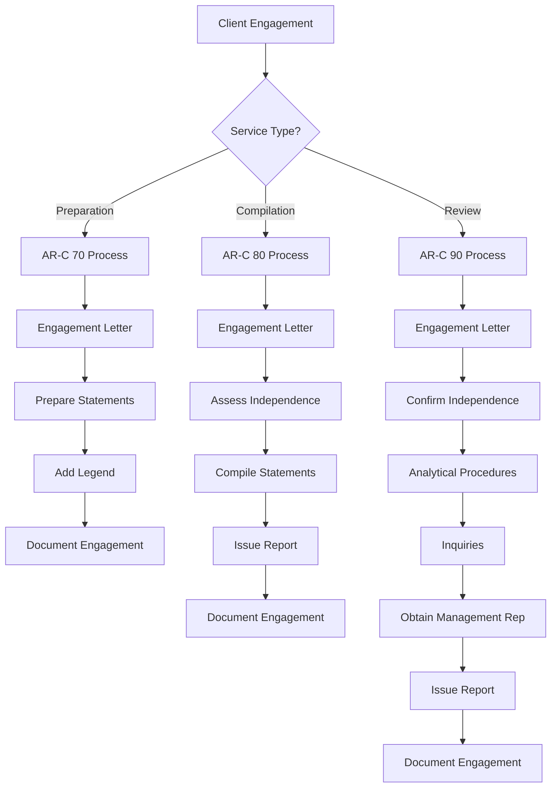

# CJCPAs Ultimate SSARS Library

## The Complete Compilation and Review Reference

Welcome to the **Ultimate SSARS Library** – your comprehensive resource for mastering Statements on Standards for Accounting and Review Services. This library covers every AR-C section with official AICPA language, plain English interpretations, and practical implementation guidance.

---

## 📚 Table of Contents

### AR-C Sections

| Section | Title | Description |
|---------|-------|-------------|
| [AR-C 60](sections/AR-C-60-General-Principles.md) | General Principles for Engagements | Foundation principles applicable to all SSARS engagements |
| [AR-C 70](sections/AR-C-70-Preparation-Engagements.md) | Preparation of Financial Statements | Preparing financial statements without providing assurance |
| [AR-C 80](sections/AR-C-80-Compilation-Engagements.md) | Compilation Engagements | Compilations with and without disclosures |
| [AR-C 90](sections/AR-C-90-Review-Engagements.md) | Review of Financial Statements | Limited assurance engagements |
| [AR-C 120](sections/AR-C-120-Pro-Forma.md) | Compilation of Pro Forma Financial Information | Pro forma financial information compilations |

### Templates & Resources

| Resource | Description |
|----------|-------------|
| [Engagement Letters](templates/engagement-letters/) | Complete engagement letter templates for all service types |
| [Management Representation Letters](templates/representation-letters/) | Management rep letters for compilations and reviews |
| [Report Templates](templates/reports/) | Standard and modified report language |
| [Analytical Procedures](checklists/analytical-procedures.md) | Analytical procedure guidance and checklists |
| [Documentation Checklists](checklists/documentation-checklists.md) | Comprehensive documentation requirements |
| [AICPA Resources](resources/aicpa-resources.md) | Links to official AICPA materials |
| [Peer Review Alerts](resources/peer-review-alerts.md) | Common deficiencies and best practices |

---

## 🎯 Quick Reference Guide

### Service Level Comparison

| Feature | Preparation | Compilation | Review |
|---------|-------------|-------------|--------|
| **Independence Required** | No | No* | Yes |
| **Report Issued** | No (legend only) | Yes | Yes |
| **Level of Assurance** | None | None | Limited |
| **Analytical Procedures** | Not required | Not required | Required |
| **Inquiries** | Not required | Not required | Required |
| **Management Representations** | Not required | Recommended | Required |
| **Engagement Letter** | Required | Required | Required |

*Lack of independence must be disclosed in compilation report

### When to Use Each Service

**Preparation (AR-C 70)**
- Client needs financial statements for internal use
- No third-party reliance expected
- Most cost-effective option
- No CPA report issued

**Compilation (AR-C 80)**
- Third parties may use the financial statements
- No assurance needed
- Can be issued with or without disclosures
- Can be issued with substantially all disclosures omitted

**Review (AR-C 90)**
- Third parties require some level of assurance
- Bank or creditor requires reviewed financial statements
- Client wants more credibility than compilation provides
- Limited assurance engagement

---

## 📋 Key Independence Considerations

### Independence Framework

```
┌─────────────────────────────────────────────────────────────┐
│                    INDEPENDENCE REQUIREMENTS                 │
├─────────────────────────────────────────────────────────────┤
│  PREPARATION (AR-C 70)                                       │
│  • Independence NOT required                                 │
│  • No disclosure needed                                      │
├─────────────────────────────────────────────────────────────┤
│  COMPILATION (AR-C 80)                                       │
│  • Independence NOT required                                 │
│  • BUT if not independent, must disclose in report          │
│  • Cannot disclose reason for lack of independence          │
├─────────────────────────────────────────────────────────────┤
│  REVIEW (AR-C 90)                                            │
│  • Independence IS required                                  │
│  • Cannot issue review report if not independent            │
│  • May step down to compilation if independence impaired    │
└─────────────────────────────────────────────────────────────┘
```

---

## 🔄 Engagement Workflow

### Standard Engagement Process



---

## 📖 How to Use This Library

1. **Start with General Principles (AR-C 60)** - Understand the foundational requirements
2. **Select Your Engagement Type** - Choose the appropriate AR-C section
3. **Review Independence Requirements** - Ensure you can perform the engagement
4. **Use the Templates** - Customize engagement letters and reports
5. **Follow the Checklists** - Ensure complete documentation
6. **Reference Peer Review Alerts** - Avoid common deficiencies

---

## ⚠️ Important Disclaimers

This library is provided for educational and reference purposes. Users should:

- Always consult current AICPA Professional Standards
- Consider state board requirements and ethics rules
- Apply professional judgment to specific situations
- Stay current with ARSC pronouncements and interpretations

**Effective Dates**: Content reflects SSARS No. 21-28 and related amendments. Always verify current effective dates for any guidance.

---

## 📞 Additional Resources

- [AICPA SSARS Homepage](https://www.aicpa.org/resources/article/statements-on-standards-for-accounting-and-review-services-ssars)
- [AICPA Professional Standards](https://www.aicpa.org/resources/download/aicpa-professional-standards)
- [Accounting & Review Services Committee](https://www.aicpa.org/resources/article/accounting-and-review-services-committee)
- [Peer Review Program](https://www.aicpa.org/resources/article/aicpa-peer-review-program)

---

## 📝 Version History

| Version | Date | Changes |
|---------|------|---------|
| 1.0 | 2024 | Initial comprehensive SSARS library release |

---

*Maintained by CJCPAs - Committed to Excellence in Professional Standards*